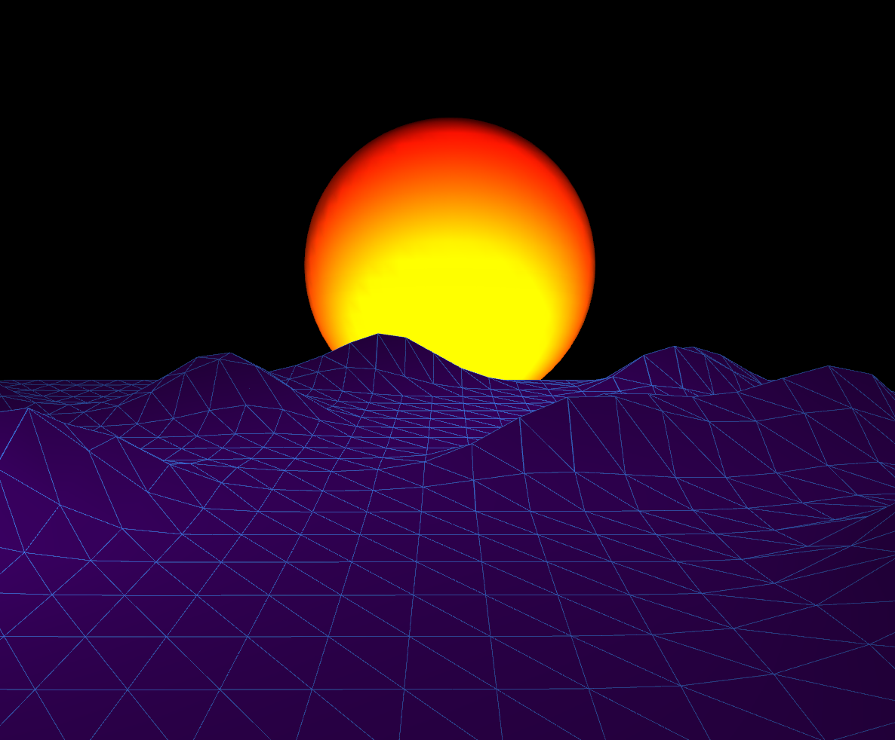

# Procedural Landscape

## Description
This is a sketch inspired by Daniel Shiffman's procedural landscape video. 
It uses a mesh with a heightmap, which is generated by perlin Noise and shifted along 
the y-axis to generate the illusion of movement. Additionally, there is a Sun, 
which is a sphere mesh with point lights.

Here's how it looks at the moment:

;

## Execution

### Prerequisites

To run this project, you need to have OpenFrameworks installed. 
Follow the instructions on the [OpenFrameworks website](https://openframeworks.cc/download/) to set 
up your environment.

### Installation

1. **Clone the repository:**

    ```
    git clone https://github.com/yourusername/your-repo-name.git
    ```

2. **Navigate to the project directory:**

    ```
    cd your-repo-name
    ```

3. **Open the project in your preferred IDE:**
    - For Xcode: Open the `.xcodeproj` file.
    - For Visual Studio: Open the `.sln` file.
    - For Code::Blocks: Open the `.cbp` file.

### Usage

1. **Compile the project:**
    - Follow the instructions for your IDE to build the project.
  
2. **Run the project:**
    - Execute the compiled application from your IDE or terminal.

### Acknowledgements

- [OpenFrameworks](https://openframeworks.cc/)